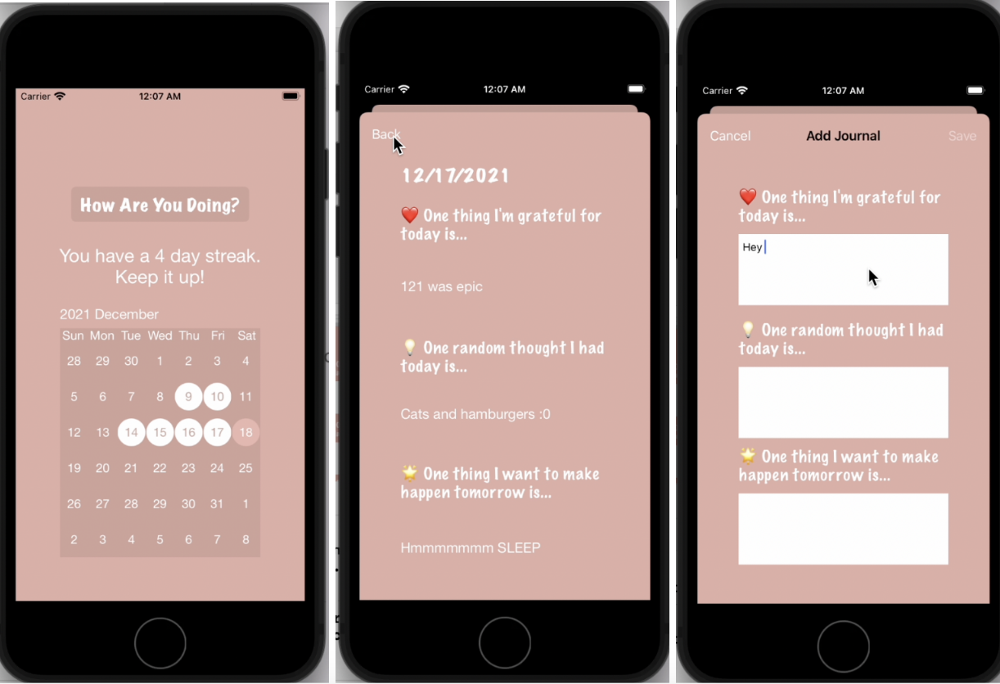

# Journaly
An iOS journal app that makes journaling an easy 5-minute routine using a built-in 3-question template.

Journals are stored and displayed from a calendar view on the main page. Streaks are calculated and displayed to encourage the user to make journaling a daily habit. The Firebase Realtime Database is used to support the backend storage of journal posts and streak info.

